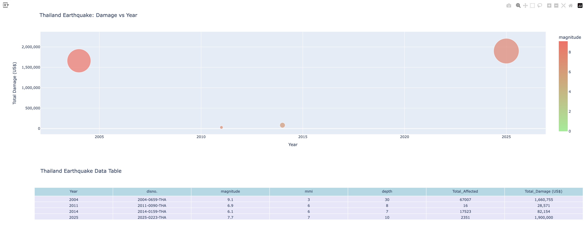
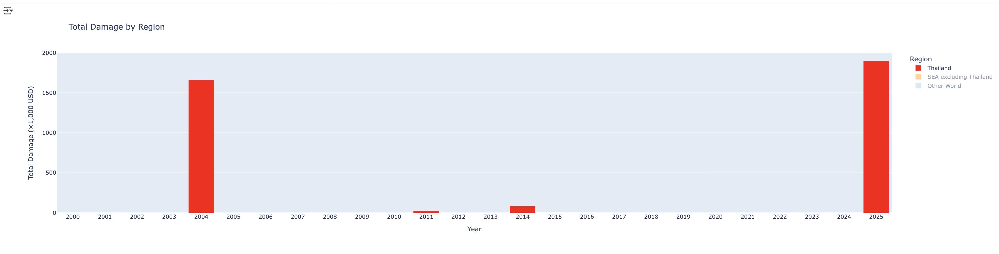
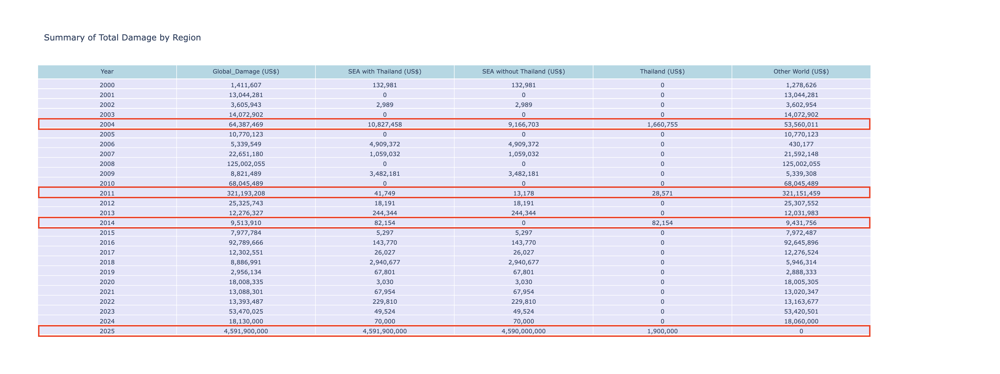

 # Mini-Project : Earthquakes in Thailand
# Group 
- name : ใครไหวไปก่อนเลย 🫨🫨
- member : กฤษฎา เมตต์การุณ์จิต, สหภูมิ เกตุแก้ว , ศิริวัฒน์ คาระวุคห์

# Source of Data : 
- กรมอุตุนิยมวิทยา ประเทศไทย. (2007–2025). ข้อมูลแผ่นดินไหว.  
  [https://data.tmd.go.th/dataset/index.php](https://data.tmd.go.th/dataset/index.php)

- Global disasters database (EM-DAT). Université catholique de Louvain (UCLouvain), Belgium.  
  [https://www.emdat.be](https://www.emdat.be)

- กองเฝ้าระวังแผ่นดินไหว, กรมอุตุนิยมวิทยา.  
  [https://earthquake.tmd.go.th](https://earthquake.tmd.go.th)

- Wikipedia contributors. *List of tectonic plates*. In: Wikipedia.  
  [https://en.wikipedia.org/wiki/List_of_tectonic_plates](https://en.wikipedia.org/wiki/List_of_tectonic_plates)

- Wikipedia contributors. *Indian Plate*. In: Wikipedia.  
  [https://en.wikipedia.org/wiki/Indian_plate](https://en.wikipedia.org/wiki/Indian_plate)

- NOAA National Geophysical Data Center (NGDC). Hazards - Earthquake.  
  [https://www.ngdc.noaa.gov/hazel/view/hazards/earthquake/](https://www.ngdc.noaa.gov/hazel/view/hazards/earthquake/)

# Research Question : วิเคราะห์แผ่นดินไหวในประเทศไทย (Film)
- ข้อมูลแผ่นดินไหวของประเทศไทยเมื่อเทียบกับประเทศในภูมิภาคเดียวกันเป็นอย่างไร
- การเกิดแผ่นดินไหวในประเทศไทยเป็นอย่างไร
- ภูมิภาคและจังหวัดใดมีการเกิดแผ่นดินไหวในประเทศไทยสูงสุด
- พื้นที่ใดในประเทศไทยมีความเสี่ยงและปลอดภัยต่อการเกิดแผ่นดินไหว 
- ผลกระทบจากการเกิดแผ่นดินไหวในประเทศไทยเป็นอย่างไร 

# Part I
## แผ่นดินไหวทั่วโลกช่วงเวลา ปี 2000 - 2025 (Dong)
- ตำแหน่งการเกิดภัยพิบัติจากแผ่นดินไหวที่มีค่า ขนาดมากกว่า 5 จะพบได้หลายทวีป เช่น อเมริกาเหนือ, อเมริกาใต้, ยุโรป, เอเชียกลาง, เอเชียตะวันออก, เอเชียตะวันออกเฉียงใต้ ซึ่งรวมบริเวณประเทศไทยด้วย
- การเกิดแผ่นดินไหวมีพิกัดและตำแหน่งเป็นแนวยาว ตามไหล่ทวีป ดังกล่าวข้างต้น ซึ่งมีความสอดคล้องกับ แผ่นเปลือกโลกหลัก 16 แผ่น ที่มีพลังงานและเคลื่อนตัวอยูในปัจจุบัน [ดูแหล่งข้อมูล](#principal-16-plates)

# Part II
## แผ่นดินไหวบริเวณประเทศไทย และ ภูมิภาคพื้นที่โดยรอบ (Tiger)

- การสังเกตแนวโน้ม คือจำนวนเหตุการณ์แผ่นดินไหวในไทยและภูมิภาคใกล้เคียงมีแนวโน้มเพิ่มขึ้นเรื่อย ๆ ตั้งแต่ปี 2007 จนถึงปี 2025 โดยบางปีมีความถี่สูงเป็นพิเศษ โดยเฉพาะปี 2014, 2022, และ 2025. [ดูแหล่งข้อมูล](#appendix-events)

  

- การบันทึกการเกิดเหตุการณ์แผ่นดินไหว ตำแหน่งและขนาด ช่วงปี 2007 - 2025 มีจำนวนกว่า 14,981 เหตุการณ์ จาก กองเฝ้าระวังแผ่นดินไหว
- ตำแหน่งการเกิดแผ่นดินไหวในประเทศไทย จะเกิดบริเวณ ภาคเหนือตอนบนติดกับพม่า ลาว และจีน รวมถึง ภาคตะวันตกและภาคใต้บางส่วน
- ตำแหน่งการเกิดแผ่นดินไหวในประเทศเพื่อนบ้าน จะเกิดบริเวณ พม่า, จีน, ลาว, อินโดนีเซีย รวมถึง ทะเลอันดามันฝั่งตะวันตก
   

- ข้อมูลแสดงจำนวนความถี่ในการเกิดเหตุการณ์แผ่นดินไหวบริเวณประเทศไทย และ พื้นที่แต่ละประเทศโดยรอบ

## อันดับประเทศที่มีจำนวนเหตุการณ์แผ่นดินไหวสูงสุด 5 อันดับ 

| อันดับ | ประเทศ | ภาพแสดงข้อมูล |
|:---:|:---:|:---:|
| 1 | 🇲🇲 **พม่า** |  |
| 2 | 🇹🇭 **ไทย** |  |
| 3 | 🇱🇦 **ลาว** |  |
| 4 | 🇮🇳 **อินเดีย (ทะเลอันดามัน)** |  |
| 5 | 🇨🇳 **จีน** |  |

# Part III
## แผ่นดินไหวในประเทศไทยในแต่ละภูมิภาค (Tiger)

- กราฟ "Number of Earthquake Events by Region in Thailand (2007–2025)" แสดงให้เห็นอย่างชัดเจนว่า ภาคเหนือ มีจำนวนการเกิดแผ่นดินไหวสูงที่สุดอย่างโดดเด่น โดยมีจำนวนเหตุการณ์สูงถึง 3,326 ครั้ง ซึ่งมากกว่าทุกภาคของประเทศรวมกัน และเมื่อนำข้อมูลนี้ไปเชื่อมโยงกับการวิเคราะห์แผ่นดินไหวรายปี จะสามารถสรุปได้ว่าแผ่นดินไหวส่วนใหญ่ที่เกิดขึ้นในประเทศนั้น มีศูนย์กลางอยู่ในภาคเหนือนั่นเอง

   

พื้นที่เสี่ยงสูงสุด: เชียงราย (1,494 ครั้ง) และ เชียงใหม่ (855 ครั้ง) มีความถี่ในการเกิดแผ่นดินไหวสูงที่สุดอย่างโดดเด่น ทำให้ทั้งสองจังหวัดเป็นพื้นที่เสี่ยงอันดับต้น ๆ ของประเทศ
พื้นที่เสี่ยงระดับรอง: จังหวัดอื่น ๆ ในภาคเหนือ เช่น แม่ฮ่องสอน (480 ครั้ง) และลำปาง (245 ครั้ง) ก็ยังมีความถี่สูงกว่าจังหวัดส่วนใหญ่

การเกิดแผ่นดินไหวต่ำ: จังหวัดในภาคอื่น ๆ เช่น กาญจนบุรี, ภูเก็ต และกระบี่ มีจำนวนแผ่นดินไหวต่ำมากเมื่อเทียบกับภาคเหนือ

  

- จำนวนเหตุการณ์แผ่นดินไหว แต่ละภูมิภาค พบว่า ภาคเหนือมีสูงสุด จำนวน 3326 เหตุการณ์
- ภาคตะวันตก จำนวน 208 เหตุการณ์
- ภาคใต้ จำนวน 89 เหตุการณ์
- ภาคตะวันออกเฉียงเหนือ จำนวน 29 เหตุการณ์
- ภาคกลาง จำนวน 25 เหตุการณ์

# Part IV
## ผลกระทบและความสูญเสียจากเหตุการณ์แผ่นดินไหว ในประเทศไทย (Film)
(Film - Add table , label with damage cost in Map plot)

จำนวนเหตุการณ์สำคัญของแผ่นดินไหวที่เกิดผลกระทบต่อประเทศไทย มีจำนวนทั้งสิ้น 4 เหตุการณ์ 
- เหตุการณ์แผ่นดินไหวที่หมู่เกาะสุมาตรตา ประเทศอินโดนีเซีย ในปี 2004
- เหตุการณ์แผ่นดินไหวที่บริเวณประเทศเมียร์ม่าทางตอนเหนือของจังหวัดเชียงราย ในปี 2011
- เหตุการณ์แผ่นดินไหวที่จังหวัดเชียงราย ในปี 2014
- เหตุการณ์แผ่ดินไหวที่ประเทศเมียร์ม่า ทางทิศตะวันออกของจังหวัด แม่ฮ่องสอน ในปี 2025

โดยอัตราความเสียหายเกิดจาก ค่าของ Magnitude และ Depth เป็นตัวบ่งบอกความเสียหายของเหตุการณ์ นั้นๆ ซึ่ง ค่า Depth จะเป็นตัวชี้วัดหลัก กว่า Magnitude เพราะค่า Depth จะส่งผลถึงคลื่นและการกระจายของแรงสั่นสะเทือน

จากแผนภาพจะสามารถ บ่งบอกได้ว่า ยิ่ง Magnitude สูง Depth น้อย ความเสียหายยิ่งมีมูลค่ามาก  และ ถ้ามี Magnitude ที่เท่าๆกัน ถ้าค่า Depth ต่าง ตัวที่น้อยกว่า จะส่งผลกระทบที่มากกว่าด้วย 

# Conclusion : (Dong)

ข้อมูลแผ่นดินไหวของประเทศไทยเมื่อเทียบกับประเทศในภูมิภาคเดียวกันเป็นอย่างไร
การเกิดแผ่นดินไหวในประเทศไทยเป็นอย่างไร
ภูมิภาคและจังหวัดใดมีการเกิดแผ่นดินไหวในประเทศไทยสูงสุด
พื้นที่ใดในประเทศไทยมีความเสี่ยงและปลอดภัยต่อการเกิดแผ่นดินไหว
ผลกระทบจากการเกิดแผ่นดินไหวในประเทศไทยเป็นอย่างไร

- จากข้อมูลที่มีแนวโน้มที่สูงขึ้นของการเกิดเหตุการณ์แผ่นดินไหวในประเทศไทยและภูมิภาคโดยรอบ นับตั้งแต่ปี 2007 จนถึงปี 2025
- ปัจจัยหนึ่งที่มีผลต่อการเกิดแผ่นดินไหวคือการเคลื่อนตัวของแผ่นเปลือกโลก [Plate Movement](#factor)
- 1. ประเทศ : พม่า, ไทย และลาว มีแนวโน้มการเกิดแผ่นดินไหวมากกว่าประเทศอื่นในภูมิภาคนี้เพราะอยู่ใกล้บริเวณรอยเลื่อนของแผ่นเปลือกโลกที่ยังคงเคลื่อนตัวอยู่
- 2. ภูมิภาค : ภาคเหนือมีแนวโน้มการเกิดแผ่นดินไหวสูงสุดและมากกว่าภาคอื่นในประเทศไทย
- 3. จังหวัด : เมื่อพิจารณาข้อมูลการเกิดแผ่นดินไหวย้อนหลังตั้งแต่ปี 2007 - 2025 เบื้องต้นสามารถพิจารณา
        * 3.1 จังหวัดที่เป็นพื้นที่เสี่ยงสูงสุด 5 อันดับ : เชียงราย เชียงใหม่ แม่ฮ่องสอน ลำปาง และ ตาก
        * 3.2 จังหวัดที่เป็นพื้นที่เสี่ยงต่อการเกิดแผ่นดินไหวทั้งหมด : 34 จังหวัด
        * 3.3 จังหวัดที่ไม่เคยเกิดแผ่นดินไหวจำนวน 43 จังหวัด ส่วนใหญ่อยู่ในภาคตะวันออก และภาคตะวันออกเฉียงเหนือ อยู่ห่างจาแนวเคลื่อนตัวของแผ่นเปลือกโลกหลัก ประเมินเบื้องต้นเป็นพื้นที่ปลอดภัย
          
        * Note : แนวทางการวิเคราะห์เพิ่มเติมสำหรับปัจจัยอื่น ๆ เพื่อค้นหาพื้นที่ปลอดภัยให้ถูกต้องแม่นยำมากยิ่งขึ้น ควรพิจารณาข้อมูล
        *  รอยเลื่อน (Active Fault) และ ระยะห่างรอยเลื่อน (Geological factors)
        *  ผลกระทบจากจังหวัดใกล้เคียง (Spatial effect)
        *  Hazard models / Ground Shaking models จากกรมทรัพยากรธรณี 

- 4. ความเสียหายจากการเกิดแผ่นดินไหว
     
# Factor 
## สาเหตุเบื้องต้นของการเกิดแผ่นดินไหวทางกายภาพทางภูมิศาสตร์
-   ข้อมูลสนับสนุน ผลของการเคลี่อนตัวของแผ่นเปลือกโลก Eurasian Plate และ Indian plate ส่งผลกระทบต่อการเกิดแผ่นดินไหวบริเวณ พม่าและไทย
-   Indian plate มีพลังงานและการเคลื่อนตัว ตั้งแต่ 71 ล้านปีก่อน เคลื่อนตัวเข้าหาแผ่นเปลือกโลกหลัก Eurasian Plate และ แผ่นเปลือกโลกย่อย Burma Plate และ Sunda Plate 
-   ทิศทางการเคลื่อนที่ทางเหนือ-ตะวันออก ด้วยความเร็วการเคลื่อนตัว 26-36 มม. ต่อ ปี

# Appendix

- Earthquake basic knowledge (option : การเตรียมตัว และการเฝ้าระวัง) : Scale of Magnitude , Active plates (Tiger)
 
- Misc :
- 1. Significant events for 2014, 2022, 2025
- 2. Other plots to support high light data

# Principal 16 plates
- แผ่นเปลีอกโลกหลัก 16 แผ่น : ประเทศไทย อยู่บนแผ่นเปลือกโลก Eurasian Plate

[กลับไปยัง Part I](#part-i)

# Appendix events
##เหตุการณ์สำคัญ ๆ การเกิดแผ่นดินไหว ในปี 2014, 2022 และ 2025 มีเหตุการณ์แผ่นดินไหวสำคัญในประเทศไทยและพื้นที่ใกล้เคียงดังนี้:
- ปี 2014
เหตุการณ์ใหญ่สุด: แผ่นดินไหว "แม่ลาว" จังหวัดเชียงราย
วันที่เกิด: 5 พฤษภาคม 2014 เวลา 18:08 น.
ขนาด: แมกนิจูด 6.3
พิกัด: จุดศูนย์กลาง 9 กม. ทางใต้ของอำเภอแม่ลาว, จังหวัดเชียงราย
ผลกระทบ: อาคาร บ้านเรือนเสียหายมากกว่า 10,000 หลัง, เกิดรอยร้าวตามถนนและวัด, มีผู้เสียชีวิต 1-2 คน.
อำเภอสำคัญที่ได้รับผลกระทบ: แม่ลาว, พาน, เมือง, เชียงราย, เชียงใหม่, ลำปาง
- ปี 2022
เหตุการณ์หลายครั้ง โดยเน้นพื้นที่ “อำเภอแม่สาย” จังหวัดเชียงราย และบริเวณใกล้เคียง
29 ก.ค. 2022: ขนาด 4.9, ใกล้แม่สาย
พิกัด: ส่วนใหญ่อยู่บริเวณแม่สาย จังหวัดเชียงราย
การรายงาน: เป็นกลุ่มการเกิดอาฟเตอร์ช็อก ไม่พบความเสียหายรุนแรง.
- ปี 2025
เหตุการณ์สำคัญ: แผ่นดินไหวรุนแรง 7.7 แมกนิจูด จุดศูนย์กลางอยู่ในประเทศเมียนมา ใกล้ชายแดนไทย (บริเวณ Sagaing)
วันที่เกิด: 28 มีนาคม 2025
ผลกระทบที่ไทย: รับแรงสั่นสะเทือนอย่างมีนัยยะสำคัญ โดยอาคารในกรุงเทพฯ สั่นไหว, ได้รับผลกระทบด้านจิตใจและมีการเตรียมพร้อมรับมือเหตุฉุกเฉิน.
เหตุการณ์แผ่นดินไหวย่อยในไทย: เช่น อ.ปางมะผ้า (แม่ฮ่องสอน) ขนาด 2.4, อ.แม่สรวย (เชียงราย) ขนาด 2.0 (มิถุนายน 2025).
[กลับไปยัง Part II](#part-ii)

# Understanding Earthquakes
## แผ่นดินไหว (Earthquake)
- อะไรเป็นสาเหตุการเกิดแผ่นดินไหว
ความสั่นสะเทือนของพื้นดินเกิดขึ้นได้ทั้งจากการกระทำของธรรมชาติและมนุษย์
ส่วนที่เกิดจากธรรมชาติ ได้แก่ การเคลื่อนตัวของเปลือกโลกโดยฉับพลัน ตามแนวขอบของแผ่นเปลือกโลก หรือตามแนวรอยเลื่อน การระเบิดของภูเขาไฟ การยุบตัวของโพรงใต้ดิน แผ่นดินถล่ม อุกาบาตขนาดใหญ่ตก เป็นต้น
ส่วนที่เกิดจากการกระทำของมนุษย์ ทั้งทางตรงและทางอ้อม เช่น การระเบิดต่างๆ การทำเหมือง สร้างอ่างเก็บน้ำใกล้รอยเลื่อน การทำงานของเครื่องจักรกล การจราจร เป็นต้น

# แมกนิจูด (Magnitude)
- Magnitude คือการวัดพลังงานที่ปลดปล่อยออกมาจากจุดศูนย์กลางแผ่นดินไหว ยิ่งค่ามากเท่าไร ผลกระทบก็ยิ่งรุนแรงมากขึ้น ซึ่งในภาพนี้แบ่งออกเป็น 8 ระดับ พร้อมคำอธิบายและภาพประกอบที่ช่วยให้เข้าใจผลกระทบได้ง่าย

| ระดับ       | ช่วง Magnitude | คำอธิบาย   | ผลกระทบโดยทั่วไป |
|-------------|----------------|------------|--------------------|
| Micro       | 1.0–1.9        | เล็กมาก     | ไม่รู้สึกเลยหรือรู้สึกเฉพาะในเครื่องมือวัด |
| Minor       | 2.0–3.9        | เล็กน้อย    | คนอาจรู้สึกได้เล็กน้อย แต่ไม่มีความเสียหาย |
| Light       | 4.0–4.9        | เบา         | สิ่งของสั่นเล็กน้อย ไม่มีผลกระทบต่อโครงสร้าง |
| Moderate    | 5.0–5.9        | ปานกลาง     | โครงสร้างอ่อนแออาจเสียหายเล็กน้อย |
| Strong      | 6.0–6.9        | รุนแรง      | อาคารบางส่วนอาจเสียหาย โดยเฉพาะที่ไม่ได้ออกแบบรองรับ |
| Major       | 7.0–7.9        | ใหญ่        | เกิดความเสียหายอย่างหนักในพื้นที่กว้าง |
| Great       | 8.0–8.9        | ใหญ่มาก     | ผลกระทบระดับภูมิภาค อาคารพังถล่ม |
| Destruction | 9.0 ขึ้นไป     | ทำลายล้าง   | ผลกระทบระดับประเทศหรือทวีป มีการเปลี่ยนแปลงภูมิประเทศ |

# ความลึก (Depth)
- DEPTH คือระยะทางจากผิวโลกลงไปยัง จุดศูนย์กลางของแผ่นดินไหว (hypocenter)
- วัดเป็นหน่วย กิโลเมตร (km)
- ยิ่งลึกมาก → พลังงานกระจายกว้าง แต่แรงสั่นสะเทือนที่ผิวโลกอาจเบาลง
- ยิ่งตื้น → พลังงานกระจุกใกล้ผิวโลก → สั่นแรงและอาจเกิดความเสียหายมาก
  

| ประเภทแผ่นดินไหว      | ความลึก (DEPTH) | ลักษณะผลกระทบ                                       |
|-------------------------|------------------|-------------------------------------------------------|
| ตื้น (Shallow)         | < 70 km          | รู้สึกแรง สั่นสะเทือนชัดเจน อาจเกิดความเสียหาย      |
| ปานกลาง (Intermediate) | 70–300 km        | รู้สึกได้ในพื้นที่กว้าง แต่แรงสั่นลดลง               |
| ลึก (Deep)             | > 300 km         | มักไม่รู้สึกบนพื้นผิว หรือรู้สึกเบา                  |

# ประเภทคลื่นแผ่นดินไหวที่ตรวจจับได้ (Phase)

1.Body Waves (คลื่นที่เคลื่อนผ่านภายในโลก)

| ประเภท              | ลักษณะการเคลื่อนที่                              | ความสำคัญ                                      |
|---------------------|---------------------------------------------------|------------------------------------------------|
| P Wave (Primary)    | คลื่นอัดตัว เคลื่อนที่ในทิศเดียวกับการแพร่คลื่น | เร็วที่สุด ใช้ระบุเวลาที่แผ่นดินไหวเริ่มต้น     |
| S Wave (Secondary)  | คลื่นเฉือน เคลื่อนที่ตั้งฉากกับการแพร่คลื่น     | ช้ากว่า P-wave ใช้คำนวณระยะห่างจากศูนย์กลาง     |

2. Surface Waves (คลื่นที่เคลื่อนที่บนผิวโลก)

| ประเภท           | ลักษณะการเคลื่อนที่                                         | ความสำคัญ                                           |
|------------------|--------------------------------------------------------------|-----------------------------------------------------|
| Rayleigh Wave    | เคลื่อนที่แบบลูกคลื่น (ขึ้น–ลง + หน้า–หลัง) คล้ายคลื่นทะเล | ทำให้พื้นดินสั่นทั้งแนวตั้งและแนวนอน               |
| Love Wave        | เคลื่อนที่แบบเฉือนแนวนอน (ซ้าย–ขวา)                         | สร้างแรงสั่นสะเทือนด้านข้างที่รุนแรง               |

# Mag vs Region
  

- กราฟนี้ช่วยให้เราเห็นภาพรวมของความรุนแรงของแผ่นดินไหวที่เกิดขึ้นในแต่ละปี โดยข้อมูลแต่ละจุดแสดงถึงค่าแมกนิจูด(Magnitude) ของแผ่นดินไหวหนึ่งครั้ง

- จากการวิเคราะห์กราฟแสดงขนาดแผ่นดินไหวรายเหตุการณ์ พบว่าแผ่นดินไหวส่วนใหญ่ในประเทศไทยและพื้นที่ใกล้เคียงมีขนาด ต่ำกว่า 5.0 ซึ่งไม่ก่อให้เกิดความเสียหายร้ายแรง แต่ก็มีแผ่นดินไหวขนาดใหญ่กว่า 6.0 เกิดขึ้นเป็นครั้งคราว
 

- ข้อมูลในกราฟมีการกระจายตัวค่อนข้างสม่ำเสมอในแต่ละปี โดยมีค่าแมกนิจูดส่วนใหญ่อยู่ระหว่าง 2.0 ถึง 5.0 แต่ในปี 2011, 2012, 2014, 2016, 2017 และ 2025 มีการตรวจพบแผ่นดินไหวขนาดใหญ่ที่โดดเด่น ซึ่งยืนยันว่าถึงแม้แผ่นดินไหวส่วนใหญ่ในภูมิภาคนี้จะเป็นขนาดเล็กและไม่เป็นอันตราย แต่พื้นที่ก็ยังคงมีความเสี่ยงที่จะเกิดแผ่นดินไหวขนาดใหญ่ได้เช่นกัน
  

- กราฟนี้แสดงให้เห็นความแตกต่างที่ชัดเจนระหว่างค่าเฉลี่ยและค่าสูงสุดของขนาดแผ่นดินไหวรายปี เส้นสีแดง (Mean MAG) ชี้ให้เห็นว่าขนาดเฉลี่ยของแผ่นดินไหวค่อนข้างคงที่อยู่ระหว่าง 2.5 ถึง 3.5 ซึ่งเป็นขนาดเล็กและไม่เป็นอันตราย
  
- ในทางกลับกัน เส้นสีส้ม (Max MAG) มีความผันผวนอย่างมาก โดยมีค่าสูงสุดถึง 8.5 ในปี 2012 และเกือบ 8.0 ในปี 2025 ซึ่งยืนยันว่าถึงแม้แผ่นดินไหวส่วนใหญ่จะมีขนาดเล็ก แต่ภูมิภาคนี้ก็ยังมีความเสี่ยงที่จะเกิดแผ่นดินไหวขนาดใหญ่ที่อาจก่อให้เกิดความเสียหายร้ายแรงได้เป็นครั้งคราว

# Part 2 : Earthquakes in Thailand

กราฟนี้แสดงให้เห็นว่าจำนวนแผ่นดินไหวในประเทศไทยมีแนวโน้มเพิ่มขึ้นอย่างต่อเนื่อง โดยมีเหตุการณ์สำคัญที่โดดเด่นคือ:
  
- ปี 2014: จำนวนแผ่นดินไหวพุ่งสูงถึง 924 ครั้ง ซึ่งสอดคล้องกับเหตุการณ์แผ่นดินไหวใหญ่ขนาด แมกนิจูด 6.3 ที่จังหวัดเชียงราย เมื่อวันที่ 5 พฤษภาคม 2014 ซึ่งถือเป็นแผ่นดินไหวที่สร้างความเสียหายรุนแรงที่สุดครั้งหนึ่งในประวัติศาสตร์ของไทย
  
- ปี 2025: จำนวนแผ่นดินไหวเพิ่มขึ้นอย่างมากอีกครั้ง โดยมีจำนวนสูงถึง 450 ครั้ง ซึ่งรวมถึงเหตุการณ์สำคัญที่เกิดขึ้นในเดือนมีนาคม 2025 นั่นคือแผ่นดินไหวครั้งใหญ่ที่ทำให้รู้สึกสั่นสะเทือนได้ถึงกรุงเทพมหานคร
  
ข้อมูลเหล่านี้ชี้ให้เห็นว่า นอกจากรอยเลื่อนในประเทศจะมีการขยับตัวอยู่ตลอดเวลาแล้ว ยังมีศักยภาพที่จะทำให้เกิดแผ่นดินไหวขนาดใหญ่จนส่งผลกระทบต่อพื้นที่ห่างไกลได้อีกด้วย

กราฟนี้แสดงให้เห็นว่าถึงแม้แผ่นดินไหวส่วนใหญ่ในประเทศไทยจะมีขนาด ต่ำกว่า 5.0 ซึ่งไม่ก่อให้เกิดความเสียหายรุนแรง แต่ก็มีแผ่นดินไหวขนาดใหญ่ที่โดดเด่นเกิดขึ้นเป็นครั้งคราว โดยเฉพาะในปี 2012 ที่ตรวจพบแผ่นดินไหวขนาดใหญ่ถึง 8.5 ซึ่งถือเป็นเหตุการณ์สำคัญที่ยืนยันว่าถึงแม้แผ่นดินไหวส่วนใหญ่จะมีขนาดเล็ก แต่ก็ยังมีศักยภาพที่จะเกิดแผ่นดินไหวรุนแรงในพื้นที่ได้เช่นกัน
  

จากการวิเคราะห์ข้อมูลภาพรวมของแผ่นดินไหวในประเทศไทย พบว่าแผ่นดินไหวที่เกิดขึ้นมีจำนวนและขนาดที่แตกต่างกันไปในแต่ละปี อย่างไรก็ตาม เมื่อพิจารณาในรายละเอียดเชิงภูมิภาค จะเห็นว่ากิจกรรมแผ่นดินไหวส่วนใหญ่กระจุกตัวอยู่เพียงบางพื้นที่

ด้วยเหตุนี้ การศึกษาในเชิงลึกเกี่ยวกับแผ่นดินไหวในภาคเหนือจึงมีความสำคัญอย่างยิ่ง เพื่อทำความเข้าใจถึงรูปแบบและผลกระทบของแผ่นดินไหวในพื้นที่ที่มีความเสี่ยงสูงสุดของประเทศ
  

กราฟนี้แสดงให้เห็นว่าการเกิดแผ่นดินไหวในภาคเหนือกระจุกตัวอยู่ที่บางจังหวัดอย่างชัดเจน โดย เชียงราย และ เชียงใหม่ มีจำนวนแผ่นดินไหวสูงที่สุดอย่างโดดเด่นที่ 1,494 และ 860 ครั้งตามลำดับ ซึ่งสอดคล้องกับแนวรอยเลื่อนมีพลังงานในพื้นที่

ในขณะที่จังหวัดอื่น ๆ เช่น แม่ฮ่องสอน, ลำปาง, และตาก พบแผ่นดินไหวในจำนวนที่น้อยกว่า ส่วนจังหวัดที่เหลือมีการเกิดแผ่นดินไหวค่อนข้างต่ำ ข้อมูลนี้ยืนยันว่า เชียงรายและเชียงใหม่เป็นพื้นที่ที่มีความเสี่ยงต่อการเกิดแผ่นดินไหวมากที่สุดในประเทศไทย

# Plot by Region in Thailand
- จำนวนเหตุการณ์แผ่นดินไหว แต่ละภูมิภาค พบว่า ภาคเหนือมีสูงสุด จำนวน 3326 เหตุการณ์
- ภาคตะวันตก จำนวน 208 เหตุการณ์
- ภาคใต้ จำนวน 89 เหตุการณ์
- ภาคตะวันออกเฉียงเหนือ จำนวน 29 เหตุการณ์
- ภาคกลาง จำนวน 25 เหตุการณ์

# 

note : [ดูแหล่งข้อมูล](#part-ii--แผ่นดินไหวบริเวณประเทศไทย-และ-ภูมิภาคพื้นที่โดยรอบ-tiger)

# Comparison of Earthquake Damages: Thailand and the World

* กราฟนี้จะแสดงให้เห็นได้ว่ามูลค่าความสูญหายที่เกิดในประเทศไทยโดยเมื่อเทียบกับ การเกิดเหตุการณ์ที่เกิดแผ่นดินไหวทั่วโลก โดยในช่วงของปี 2025 เหตุการณ์แผ่นดินไหวที่พม่าที่ส่งผลกระทบมายังประเทศไทยระดับความเสียหายค่อนค้างมีมูลค่ามากสูงเกือบเท่ามูลค่าความสูญหายจากเหตุการณ์ทั่วโลก

